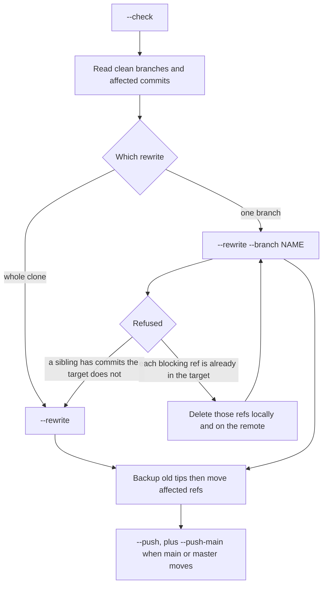
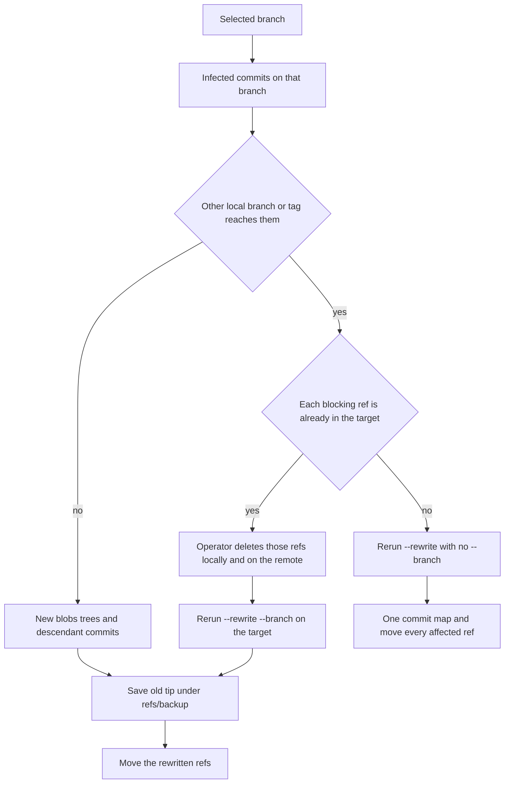

# git-dropper-cleanup

Public **aftermath** toolkit for repositories hit by a JavaScript **dropper** malware: remove the appended payload from the worktree and git history **without** running Node, npm, vite, or any code from the infected clone. It does not change git config.

**Start here** for setup and the cleanup runbook. Optional signing (SSH/GPG and history normalize) is in **[docs/signing.md](docs/signing.md)**.

**Signed commits are not required.** Without a signing key, `--rewrite` still works; new commits are simply unsigned.

Do not open the clone in an editor, and do not run `npm` or `vite`, until `--check` shows a clean worktree and no affected commits.

## Layout

| Path | Purpose |
| --- | --- |
| `git_dropper_cleanup/` | Main cleaner (`uv run git-dropper-cleanup`) |
| `sign_history/` | Optional Verified-history pass (`uv run sign-history`) |
| `docs/signing.md` | Optional commit signing + sign-history |
| `tests/` | Unit tests (`uv run pytest`) |
| `e2e/` | Docker / host end-to-end rewrite test |
| `.env.example` | `CLONE_ROOT` for URL clones |

## Quick start

```bash
# Install uv: https://docs.astral.sh/uv/
uv sync --extra dev
cp .env.example .env          # Windows: copy .env.example .env
# Edit CLONE_ROOT if you will clone from URLs

uv run git-dropper-cleanup --help
uv run git-dropper-cleanup "$CLONE_ROOT/owner/repo" --check
```

Without uv:

```bash
python3 -m venv .venv
source .venv/bin/activate     # Windows: .venv\Scripts\Activate.ps1
pip install -e ".[dev]"
python -m git_dropper_cleanup --help
```

**Prerequisites:** Python **3.11+**, **git** on `PATH`. **Docker** only if you run the e2e image. Signing is optional — see [docs/signing.md](docs/signing.md).

## What each run can change

| Command | What it changes | What it leaves alone |
| --- | --- | --- |
| `--check` | Nothing. It only prints a report. | The clone, the remotes, and git config. |
| `--fix` | Code files in the current checkout. | History, other branches, and `tasks.json`. No commit is created. |
| `--branches` | The tip of each local branch, and it commits when a signing key already exists. | Older commits. Without a signing key it only cleans the current checkout. |
| `--rewrite` | Infected commits and every commit that comes after them. | Commits before the first infected commit. Their SHAs stay the same. |
| `--rewrite --branch NAME` | That branch only, and only when no other local branch or tag reaches the same infected commits. | Every other ref. |
| `--push` | The remote refs you choose. A rewrite uses `--force-with-lease`. | `main` and `master` unless you also pass `--push-main`. Backup refs are never pushed. |

`tasks.json` is reported when it contains the marker and is never edited. Backup tips are stored under `refs/backup/git-dropper-cleanup/` and are not pushed.

A rewritten commit gets a new SHA. Every later commit on that line also gets a new SHA, because its parent changed. Clean commits before the infection keep their original SHAs.

## Configuration

`.env` is not committed. The only setting is **`CLONE_ROOT`**. A URL is cloned to `CLONE_ROOT/owner/repo`. A relative value is resolved from the directory that contains `.env`.

```text
CLONE_ROOT=./clones
```

If `.env` is missing, or `CLONE_ROOT` is empty, a URL clone stops before anything is downloaded. A local repository path does not need `CLONE_ROOT`.

Do not put a signing key in `.env`.

## Sequence



Remote-tracking branches are reported by `--check` and are not a reason to refuse. They are not moved. Create a local branch first when a remote-only branch must be rewritten. After a rewrite, `--push` can update the remote with `--force-with-lease` because those remote-tracking refs still point at the old commits.

## Check

`--check` is the default. It clones a URL when the folder is not already there, then prints:

- the worktree, or `clean`
- every local branch, as `clean` or `N affected commits`
- every tag and every remote-tracking branch in the same form
- each affected commit once: a short SHA, the branches and tags that reach it, and the file path
- a backup line when `refs/backup/git-dropper-cleanup` or `refs/original` still contains the dropper

The exit code is **1** when the worktree, a branch, a tag, a remote-tracking branch, or `tasks.json` still has the dropper. A backup ref alone does not fail the check.

```bash
uv run git-dropper-cleanup https://github.com/owner/repo.git --check
uv run git-dropper-cleanup "$CLONE_ROOT/owner/repo" --check
```

On Windows PowerShell, use `$env:CLONE_ROOT\owner\repo` instead of `$CLONE_ROOT/owner/repo`.

Example:

```text
== /path/to/clones/owner/repo
worktree (main): clean
branches:
  feature: clean
  main: 2 affected commits
tags:
  none
remotes:
  origin/main: 2 affected commits
commits:
  abc123def456  main  src/app.js
  789abc012def  main  src/app.js
```

Stop here when you do not want that repository changed.

## Fix

`--fix` removes the dropper from code files in the current checkout. It does not commit and does not switch branches.

```bash
uv run git-dropper-cleanup "$CLONE_ROOT/owner/repo" --fix
```

## Branch tips

`--branches` is for the tips only. It does not rewrite older commits. When a signing key is configured, it checks out each local branch, cleans it, and commits. Without a signing key it cleans the current checkout only and does not switch branches.

```bash
uv run git-dropper-cleanup "$CLONE_ROOT/owner/repo" --branches
```

Prefer `--rewrite` when the dropper is in older commits. A tip commit made before a rewrite is discarded by that rewrite.

## Rewrite

`--rewrite` finds commits whose code files contain the dropper, then builds new blobs, trees, and commits without checking out each revision. Author, committer, dates, and message are kept. A configured `user.signingkey` is used to sign. The tool does not run `git config`.

Commits before the first infected commit keep their SHAs. The infected commit and every descendant get new SHAs. One shared history is rewritten once, so two branches that contain the same commit receive the same replacement SHA. Clean branches stay where they are.

The old tip of each moved ref is saved under `refs/backup/git-dropper-cleanup/` the first time that ref is moved. Those backup refs are not pushed.

The worktree must match the last commit. If it does not, the rewrite stops. After the checked-out branch moves, the worktree is reset to the new tip so the infected files do not stay on disk.

```bash
uv run git-dropper-cleanup "$CLONE_ROOT/owner/repo" --rewrite
```

## One branch

`--branch NAME` limits the rewrite to that local branch. Before any object is written, the tool refuses when another local branch or tag can still reach those infected commits. Nothing is moved and nothing is pushed.

```bash
uv run git-dropper-cleanup "$CLONE_ROOT/owner/repo" --rewrite --branch feature
```

Push that branch in the same command when you already accept the rewrite:

```bash
uv run git-dropper-cleanup "$CLONE_ROOT/owner/repo" --rewrite --branch feature --push
```

`main` and `master` still require `--push-main`:

```bash
uv run git-dropper-cleanup "$CLONE_ROOT/owner/repo" --rewrite --branch main --push --push-main
```

## After a refusal

The tool does not delete branches or tags. Do not rewrite the related branches one after another. Separate runs would create a second replacement SHA for the same commit.



Use the message the tool prints.

- Every blocking ref is already contained in the branch you named. A merged or fast-forwarded feature branch is this case. Delete those local refs, delete the same branches on the remote, then rerun `--rewrite --branch` on the target. The target still has the commits, so one rewrite replaces them once. Delete a tag only when you mean to drop that tag. If the feature commits are also on `develop` and `main`, deleting the feature branch still leaves both, so use the next option.
- Any blocking ref has commits the target does not have. Rerun `--rewrite` with no `--branch`. That walks the shared commits once and moves every local branch and tag that reaches them. Clean branches stay put.

```bash
git -C "$CLONE_ROOT/owner/repo" branch -d feature
git -C "$CLONE_ROOT/owner/repo" push origin --delete feature
uv run git-dropper-cleanup "$CLONE_ROOT/owner/repo" --rewrite --branch main
```

A squash or rebase merge does not put the original feature commits on the target. Deleting the feature branch removes that second copy. The target still needs its own rewrite when its commits contain the dropper. Remote-tracking refs do not cause the refusal, so deleting the remote feature branch is a separate step after you have confirmed it is merged.

## Push

Run `--push` only after `--check` on the rewritten clone looks right. A rewritten history is pushed with `--force-with-lease`. Without a rewrite, the push is a normal push.

`--push` with no `--branch` pushes every local branch. Tags are included only when this clone was rewritten and you did not limit the push to one branch. `--push --branch NAME` pushes only that branch.

`--push-main` is required before a rewritten `main` or `master` moves. If it is missing, no branch from that command is pushed.

```bash
uv run git-dropper-cleanup "$CLONE_ROOT/owner/repo" --push --push-main
```

You can push later, after a rewrite that you already reviewed:

```bash
uv run git-dropper-cleanup "$CLONE_ROOT/owner/repo" --push --push-main
uv run git-dropper-cleanup "$CLONE_ROOT/owner/repo" --push --branch feature
```

## Several repositories

Pass more than one path in one command. A folder of clones is not rewritten all at once unless you also pass `--all-in-dir`.

## Signing

No signing key is required to remove the dropper. Details, SSH/GPG setup, and **`uv run sign-history`** live in **[docs/signing.md](docs/signing.md)**.

**`--email`** on sign-history is optional; when omitted it uses the clone’s **`user.email`**.

## Tests

```bash
uv run pytest
```

Unit tests need **git** on `PATH`. They build a temporary sample repository and do not clone or push.

### End-to-end (Docker)

Creates an infected sample repo, runs `--rewrite`, asserts `--check` is clean:

```bash
docker build -f e2e/Dockerfile -t git-dropper-cleanup-e2e .
docker run --rm git-dropper-cleanup-e2e
```

Same steps on a host with uv and git:

```bash
bash e2e/run.sh
```
